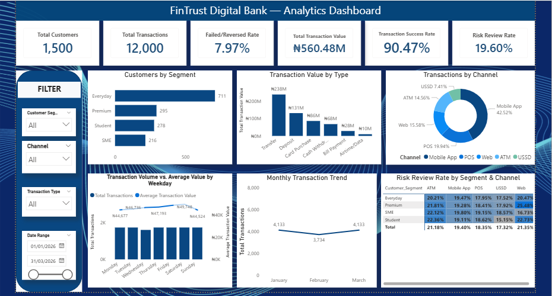

# FinTrust Digital Bank: Analytics & Intelligence Project


A Data Analytics track project for the **AnalystLab Africa Experience Lab Internship Programme**, built on a synthetic dataset of 1,500 customers and 12,000 transactions (January to March 2026) from the fictional FinTrust Digital Bank. Over four weeks it moved from planning, to data preparation and SQL/Python analysis, to a Power BI dashboard, and finally to testing every finding properly before reporting it.

> **Disclaimer:** FinTrust is fictional and all data is synthetic. `Risk_Review_Flag` is an educational label, not a fraud determination. Nothing here is a real banking risk decision, and this is not a production banking system.

---

## Repository structure

```
fintrust-digital-bank-analytics/
├── week1/   planning, data profiling, KPI and dashboard plan
├── week2/   data quality workbook, first SQL set, EDA notebook, first dashboard
├── week3/   advanced SQL, advanced Python analysis, expanded dashboard, documentation
├── week4/
│   ├── FinTrust_Week4_Final_SQL_Analysis.sql
│   ├── FinTrust_Week4_Final_Python_Analysis.ipynb
│   ├── FinTrust_Week4_Final_Analytics_Dashboard.pbix
│   ├── FinTrust_Week4_Final_Insights_and_Validation.docx
│   └── dashboard_screenshot.png
└── README.md
```

---

## What I did, week by week

- **Week 1:** Business understanding, data profiling, KPI planning and a dashboard sketch.
- **Week 2:** Data quality assessment in Excel, 8 SQL business questions in PostgreSQL, 8 Python visualisations, and a first Power BI dashboard.
- **Week 3:** 8 advanced SQL queries (CTEs, window functions), 6 more Python analyses, and a dashboard with drill-down, a weekday trend and a risk/success heatmap toggle.
- **Week 4:** A final SQL set, a final Python notebook that reproduces every number in the write-up, a dashboard review, and final insights with a proper validation of each finding.

---

## Final dashboard



Six KPI cards, charts for customer segment, transaction type, channel, weekday pattern, monthly trend and risk-review rate by segment and channel (with a toggle to a success-rate view), plus slicers for segment, channel, transaction type and date range.

---

## KPI definitions

All six KPIs were recalculated directly from the CSV files in the Week 4 notebook and match the dashboard.

| KPI | Definition | Value |
|---|---|---|
| Total Customers | Distinct customers in the customer table | 1,500 |
| Total Transactions | Count of all transaction rows | 12,000 |
| Failed/Reversed Rate | Share of transactions with status Failed or Reversed | 7.97% (956 of 12,000) |
| Total Transaction Value | Sum of `Amount_NGN` | ₦560.48M |
| Transaction Success Rate | Share of transactions with status Successful | 90.47% |
| Risk Review Rate | Share of transactions with `Risk_Review_Flag` = Yes | 19.60% |

Supporting measures in the model: Average Transaction Value (₦46.71K) and High Value Risk Rate (29.5%), which uses an `Is_High_Value` column marking each transaction in the top 10% of value for its own transaction type.

```
Total Transactions = COUNTROWS(Transactions)

Transaction Success Rate =
DIVIDE(
    CALCULATE(COUNTROWS(Transactions), Transactions[Transaction_Status] = "Successful"),
    COUNTROWS(Transactions)
)

Failed/Reversed Rate =
DIVIDE(
    CALCULATE(COUNTROWS(Transactions), Transactions[Transaction_Status] IN {"Failed", "Reversed"}),
    COUNTROWS(Transactions)
)
```

One fix worth noting: an early version of the Total Transactions measure wrapped the table in `ALL()`, which removes the chart's own filters. Every bar in the status chart showed 12,000. Removing `ALL()` restored the real counts (10,856 successful, 630 failed, 326 reversed, 188 pending).

---

## Key findings

In Week 3 I labelled several findings as validated after only comparing numbers in a grid. In Week 4 I ran significance tests on all of them, and four did not hold up. This table shows where each finding ended up.

| Finding | Evidence | Result |
|---|---|---|
| International transactions are flagged more often | 36.9% vs. 18.9%, p < 0.001, higher in every segment | Validated |
| High-value transactions are flagged more often | 29.5% vs. 18.5%, p < 0.001, holds for domestic and international separately | Validated |
| Customer attributes don't explain how often someone transacts | Engagement r = 0.038 (p = 0.238); tenure, age, income band, account type and segment also not significant | Validated |
| February "dip" | 4,133 / 3,734 / 4,133 transactions is a flat 133.3 / 133.4 / 133.3 per day | Calendar artifact, withdrawn |
| Mobile App is the least reliable channel | 89.75% vs. 91.00%, but the five channels together are not significantly different (p = 0.143) | Weakened: small gap |
| Premium is the highest-risk segment | 19.29% to 20.33% across segments, p = 0.751 | Not supported |
| Student customers on Web are the weakest pairing | 88.07%, p = 0.120; chance produces a cell that low 73% of the time | Not supported |
| Premium on Web is a risk hotspot | 25.48% (92 of 361); chance produces a cell that high about 14% of the time | Watchlist item, not a finding |

The last three come from picking the most extreme of 20 segment-by-channel cells, which is why they were tested with a simulation as well as a standard test. The full write-up is in `week4/FinTrust_Week4_Final_Insights_and_Validation.docx`.

---

## The date bug

`Transaction_DateTime` is stored as text in month/day/year format. Excel and Power BI both read it day-first, which produced exactly 7,201 bad dates in each, one for every date where the day of the month is above 12. In PostgreSQL I avoided it by importing the column as text and converting it with an explicit format (`TO_TIMESTAMP(..., 'MM/DD/YYYY HH24:MI')`). In Excel and Power BI I rebuilt the date from its parts with a formula. The Python notebook uses an explicit format too. The lesson is to spell out the date format instead of trusting auto-detection.

---

## How to reproduce

1. **Data:** place the customer and transaction CSV files in one folder.
2. **SQL:** create the `customers` and `transactions` tables in PostgreSQL, import the CSVs, add a `txn_datetime` column using `TO_TIMESTAMP`, then run `FinTrust_Week4_Final_SQL_Analysis.sql`.
3. **Python:** run `pip install pandas numpy matplotlib seaborn scipy`, put the notebook in the same folder as the CSVs, and run all cells. It recalculates the KPIs and every test in the write-up, and uses a fixed random seed so the simulation gives the same result each time.
4. **Power BI:** open the `.pbix` in Power BI Desktop. If the file paths have changed, update them under Transform data > Data source settings.

---

## Limitations

- The data is synthetic and covers only three months, so longer-term seasonality can't be assessed.
- `Risk_Review_Flag` is an educational label, so the risk findings describe the label, not real fraud.
- Segment-by-channel cells hold between 140 and 2,368 transactions, so the smaller ones move around a lot from chance alone. The dashboard heatmaps are descriptive, not proof that a cell differs.
- The p-values assume transactions are independent. I ran many tests, so a few weak results could look significant by accident. The international and high-value results are far below any plausible threshold.

---

## Lessons learned

- **Test before calling something validated.** A number that stands out in a grid is a lead to check, not a conclusion.
- **If the same bug appears in two tools, look at the data.** The date issue was the format, not the software.
- **Check dashboard numbers against the raw data.** The `ALL()` mistake looked fine until I compared a chart with the real counts.

---

## Author

**Olabisi Amusan**
Data Analyst
Microsoft Certified: Power BI Data Analyst Associate (PL-300)
[LinkedIn](https://linkedin.com/in/amusanolabisi) · [GitHub](https://github.com/amusanolabisi)

